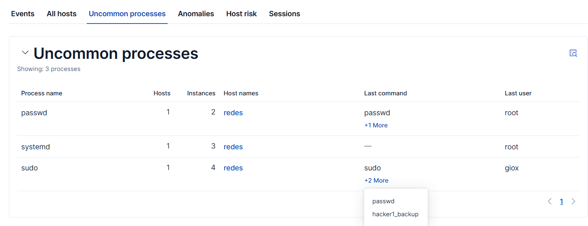
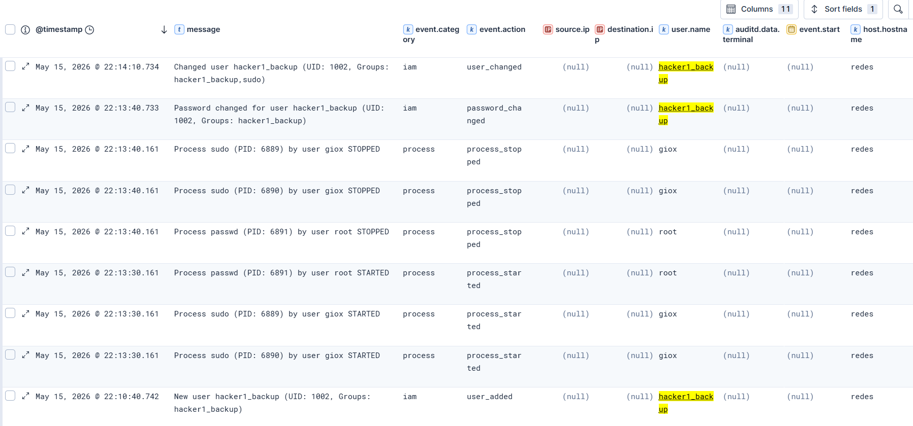
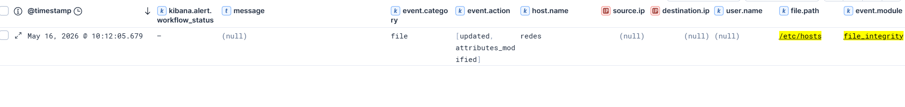

# Casos de Uso y Simulación de Ataques (Alertas)

Para validar la eficacia de nuestro SIEM, ejecutaremos simulaciones de técnicas tácticas comunes en ciberataques.

## Escenario A: Creación de Usuario Malicioso y Escalada de Privilegios (Persistencia)

Los atacantes suelen crear cuentas de respaldo para mantener el acceso a un sistema comprometido y les otorgan privilegios administrativos.

**Ejecución:**
En la terminal de Ubuntu simulamos la creación de un usuario no autorizado:

```bash
# 1. Crear el usuario
sudo useradd -m hacker1_backup

# 2. Asignarle una contraseña
echo "hacker1_backup:P@ssw0rd123!" | sudo chpasswd

# 3. Agregar el usuario al grupo 'sudo' (Escalada de privilegios)
sudo usermod -aG sudo hacker1_backup
```

**Detección:**
Inmediatamente, el SIEM recoge esta actividad. En Elastic Security, bajo la sección de `Uncommon processes` o explorando los eventos (`Discover`), podemos observar de forma explícita toda la cadena de comandos.

El SIEM clasifica estas acciones bajo la categoría de `iam` (Gestión de Identidad y Accesos) y etiqueta los eventos como `user_added` y `user_changed`.




## Escenario B: Monitoreo de Integridad de Archivos (FIM) y DNS Spoofing

Auditbeat incluye un módulo de File Integrity diseñado para detectar en tiempo real modificaciones a archivos críticos del sistema.

**Ejecución:**
Inyectaremos una redirección falsa apuntando el dominio www.google.com a una IP local arbitraria.

```bash
# Agregar una redirección falsa al archivo hosts
echo "192.168.1.100 www.google.com" | sudo tee -a /etc/hosts
```

**Detección (Blue Team):**
Utilizamos la siguiente consulta en la barra de búsqueda de Elastic (KQL):

```kql
event.module: "file_integrity" AND file.path: "/etc/hosts"
```

El SIEM nos muestra una alerta de nivel `file` con la acción `updated / attributes_modified`. El analista de seguridad puede ver exactamente qué archivo fue manipulado, en qué máquina y la marca de tiempo exacta del compromiso.


