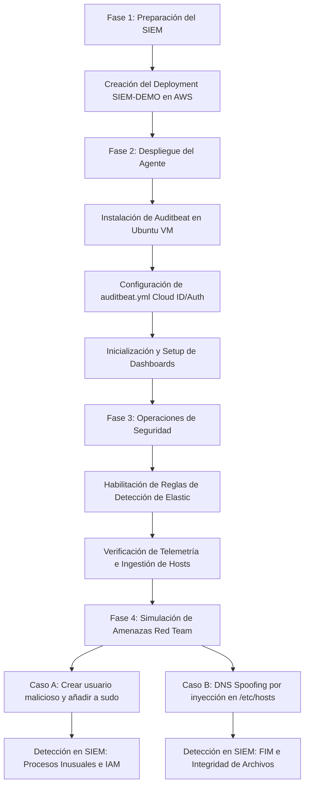

# Arquitectura del Proyecto

Este proyecto simula un escenario de Blue Team con recolección de telemetría a través de Auditbeat hacia un entorno Elastic SIEM alojado en la nube.

```mermaid
graph TD
    A[Fase 1: Preparación del SIEM] --> B[Creación del Deployment SIEM-DEMO en AWS]
    B --> C[Fase 2: Despliegue del Agente]
    C --> D[Instalación de Auditbeat en Ubuntu VM]
    D --> E[Configuración de auditbeat.yml Cloud ID/Auth]
    E --> F[Inicialización y Setup de Dashboards]
    F --> G[Fase 3: Operaciones de Seguridad]
    G --> H[Habilitación de Reglas de Detección de Elastic]
    H --> I[Verificación de Telemetría e Ingestión de Hosts]
    I --> J[Fase 4: Simulación de Amenazas Red Team]
    J --> K[Caso A: Crear usuario malicioso y añadir a sudo]
    J --> L[Caso B: DNS Spoofing por inyección en /etc/hosts]
    K --> M[Detección en SIEM: Procesos Inusuales e IAM]
    L --> N[Detección en SIEM: FIM e Integridad de Archivos]
```
