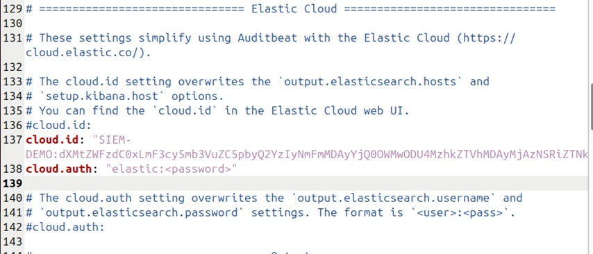
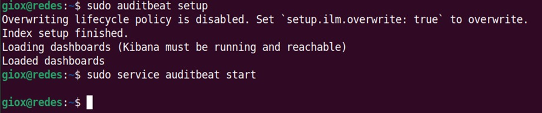
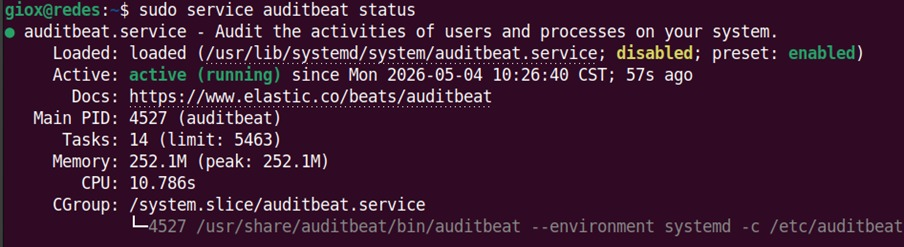

# Configuración y Conexión de Auditbeat a Elastic Cloud

## 1. Configuración de Conexión a la Nube

Editamos el archivo de configuración principal de Auditbeat para establecer la conexión con nuestro entorno en Elastic Cloud.

```bash
sudo nano /etc/auditbeat/auditbeat.yml
```

> [!TIP]
> `nano` es el estándar industrial para administración de sistemas en servidores Linux sin interfaz gráfica. Puedes usar `gedit` si cuentas con entorno gráfico X11.

Modificamos los siguientes parámetros con los datos guardados en la Fase 1:

```yaml
cloud.id: "SIEM-DEMO:dXMtZWFzdC0xLmF3cy5mb3VuZC5pbyQ2YzIy..."
cloud.auth: "elastic:<tu_contraseña_aqui>"
```



## 2. Inicialización del Agente

Ejecutamos el comando setup para cargar los dashboards predeterminados en Kibana e iniciamos el servicio:

```bash
# Cargar dashboards y plantillas (Este paso puede tardar unos minutos)
sudo auditbeat setup

# Iniciar el servicio de Auditbeat
sudo service auditbeat start

# Comprobar el estado del servicio
sudo service auditbeat status
```





> [!NOTE]
> Finalmente, regresamos a la consola web de Elastic y presionamos `Check data` para confirmar que los datos se están recibiendo correctamente (Data successfully received).
