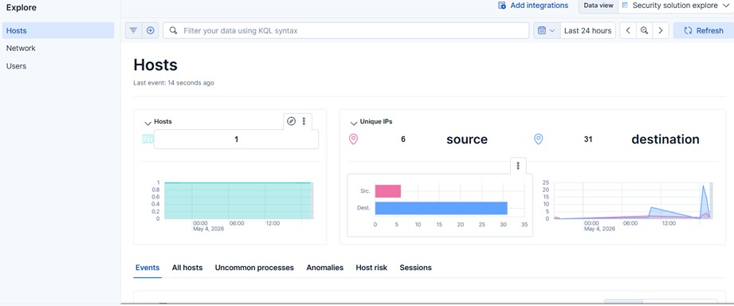

# Dashboards y Monitoreo General

Una vez que Auditbeat está instalado y configurado correctamente, podemos verificar el monitoreo inicial desde los Dashboards de Kibana.

Verificamos en el Dashboard principal de Hosts e IPs cómo Auditbeat ya está reportando eventos del sistema (`process_started`, usuarios, flujos de red, etc.). Los eventos fluirán en tiempo real.
