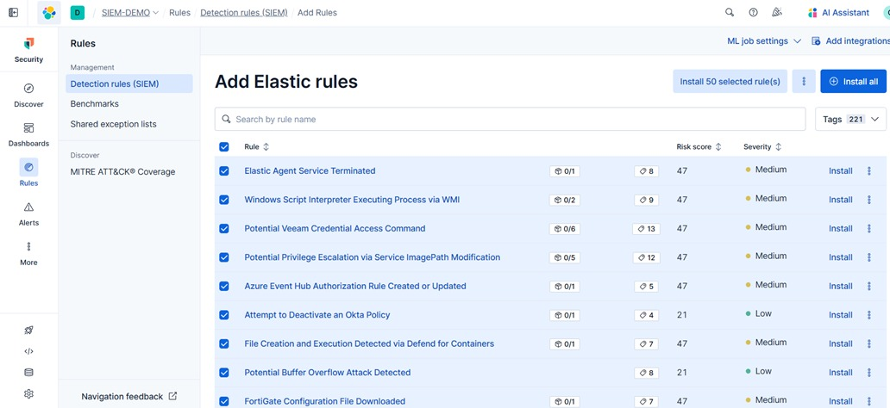

# Reglas de Detección

## Instalación de Reglas de Detección

Por defecto, las reglas de SIEM no vienen instaladas. 

1. Navegamos a `Rules` > `Detection rules (SIEM)` > `Add Rules`
2. Instalamos las reglas prediseñadas por Elastic para empezar a monitorear comportamientos anómalos.

