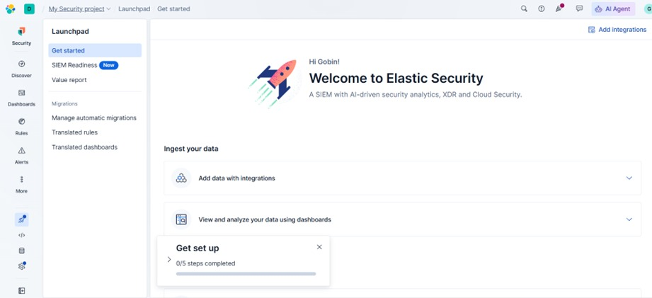
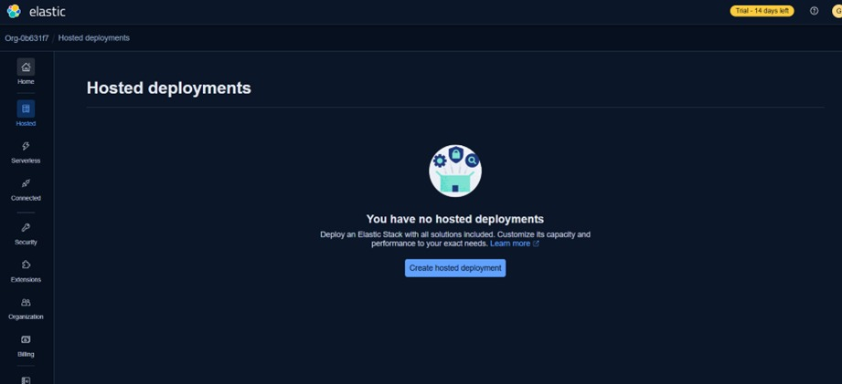
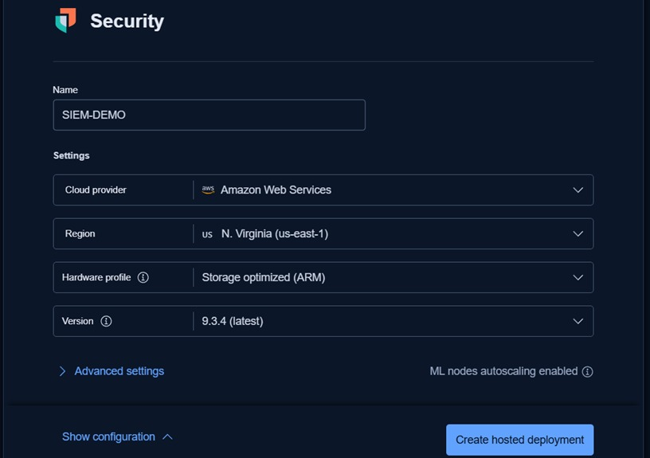
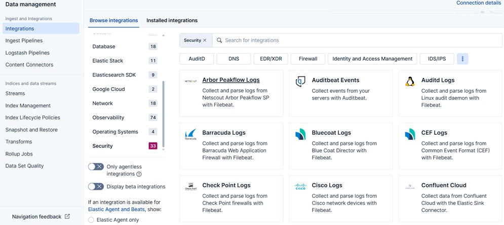
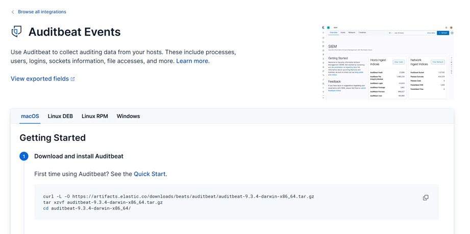
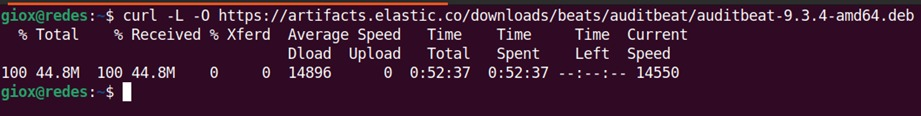
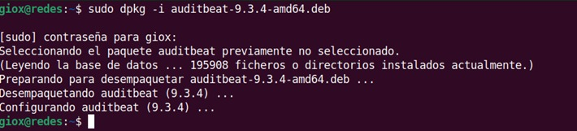
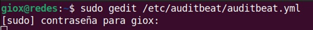

# Fase 1: Configuración en Elastic Cloud

> [!NOTE]
> Este documento cubre el registro y la creación del entorno de laboratorio utilizando Elastic Security alojado en la nube.

## 1. Registro y Creación del Deployment

Para comenzar, nos registramos en el portal de Elastic y accedemos al dashboard principal para crear nuestro entorno de trabajo.
[https://cloud.elastic.co/login](https://cloud.elastic.co/login?redirectTo=%2Fhome)




Creamos un nuevo Deployment especificando el proveedor de nube y la región:
- **Name**: SIEM-DEMO
- **Cloud Provider**: AWS (o el de preferencia)
- **Version**: Última versión disponible (ej. 9.3.4)





> [!IMPORTANT]
> **Respaldo de Credenciales**: Es crítico descargar y guardar de forma segura el usuario, la contraseña generada automáticamente y el Cloud ID, ya que los utilizaremos para vincular nuestro agente (Auditbeat) más adelante.

---

# Fase 2: Descarga e Instalación de Auditbeat (Ubuntu)

Para auditar y monitorear los procesos y archivos de nuestra máquina Ubuntu, utilizaremos la integración de Auditbeat Events.

## 1. Búsqueda de la Integración en Elastic

Dentro de Elastic Security, navegamos a `Add Integrations` y buscamos `Auditbeat Events`, seleccionando las instrucciones para Linux (DEB).





## 2. Instalación en la Máquina Ubuntu

Accedemos a nuestra terminal en Ubuntu. Primero, aseguramos tener `curl` instalado y luego descargamos e instalamos el paquete `.deb` de Auditbeat:

```bash
# Instalar curl (si no está instalado)
sudo apt update && sudo apt install curl -y

# Descargar Auditbeat
curl -L -O https://artifacts.elastic.co/downloads/beats/auditbeat/auditbeat-9.3.4-amd64.deb

# Instalar el paquete
sudo dpkg -i auditbeat-9.3.4-amd64.deb
```




